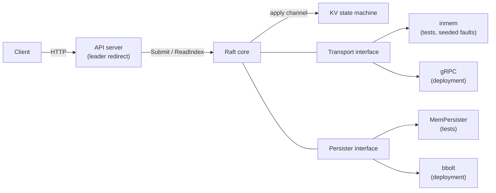

# RaftKV

A replicated, strongly-consistent key-value store with the Raft consensus
protocol implemented from scratch in Go.

[](https://github.com/rohityaduvxnshi/RaftKV/actions/workflows/ci.yml)

[](LICENSE)


Project page: [raftkv.dash-board.in](https://raftkv.dash-board.in) (coming with Phase 8 — not yet live) ·
Source: [github.com/rohityaduvxnshi/RaftKV](https://github.com/rohityaduvxnshi/RaftKV)

## What it is

RaftKV is a mini-etcd: leader election, log replication, crash-safe
persistence, snapshotting, linearizable reads, and exactly-once client
sessions, built on a from-scratch implementation of the Raft paper's
Figure 2 — no `hashicorp/raft`, `etcd/raft`, or `dragonboat`.

The headline is correctness under faults, and every claim is backed by a
named test or measurement: a deterministic, seedable in-process network
drives the core through drops, reordering, delays, partitions, and crashes
under `go test -race`; concurrent histories are checked with
[Porcupine](https://github.com/anishathalye/porcupine); and Docker-native
chaos scripts kill and partition the leader of a live 5-node cluster. See
[Correctness](#correctness).

## Features

| Feature | Notes |
| --- | --- |
| Leader election | Randomized 150–300 ms timeouts; Figure-2 step-down at every term observation |
| Log replication | Log-matching check, conflict fast backup, quorum commit with the own-term rule (§5.4.2) |
| Crash-safe persistence | bbolt WAL-style log; term/vote and entries fsynced before acting or acking |
| Snapshotting / compaction | App-triggered `Raft.Snapshot`; byte threshold via `-snap-bytes` |
| InstallSnapshot RPC | Leader catches up a follower whose needed log prefix is compacted |
| Linearizable reads | ReadIndex with quorum heartbeat confirmation; no-op barrier on election |
| Exactly-once client sessions | `(ClientID, SeqNo)` dedup with cached results; survives snapshots |
| gRPC inter-node transport | Protobuf service mirroring the Figure-2 RPCs |
| HTTP client API | GET / PUT / DELETE / CAS / append; 307 redirect to the leader |
| Observability | Prometheus gauges + HTTP latency histogram; provisioned Grafana dashboard |
| Docker compose clusters | 3-node and 5-node, with Prometheus and Grafana |
| Chaos scripts | Kill-leader and leader-partition, Docker-native (`chaos/`) |
| Porcupine linearizability check | 210 concurrent ops verified linearizable (`TestLinearizability`) |
| Load test | `cmd/loadtest`: throughput + client-side latency percentiles |

## Architecture



The Raft core (`internal/raft`) depends on exactly two interfaces:
`Transport` and `Persister`. That split is the point of the design. The
in-memory transport is a deterministic, seedable network that drops,
delays, reorders, and partitions messages, so failures reproduce; the
in-memory persister exercises the identical truncation semantics without
disk. The same core, unchanged, then runs the real cluster over gRPC and
bbolt — `TestGRPCReplication` passes the same election and replication
checks against a real 3-node gRPC cluster as the in-memory one. Details in
[docs/architecture.md](docs/architecture.md) and [docs/raft.md](docs/raft.md).

## Quick start

Bring up a 5-node cluster (tolerates 2 node failures) with Prometheus and
Grafana:

```sh
docker compose -f deploy/docker-compose.5node.yml up --build
```

Each node's HTTP API is published on host ports 8080–8084. Write with a
client session (the `X-Client-Id` / `X-Seq-No` headers make retries
exactly-once):

```sh
curl -i -X PUT http://localhost:8080/kv/greeting \
     -H 'X-Client-Id: demo' -H 'X-Seq-No: 1' -d 'hello'
# 204 No Content

curl http://localhost:8080/kv/greeting
# {"value":"hello"}
```

If the node you hit is a follower, it answers `307 Temporary Redirect` to
the leader. The redirect targets in-network hostnames (`raft0:8080`, …),
so from the host simply try ports 8080–8084 until one answers `200`/`404`
directly — that node is the leader (`chaos/lib.sh` does exactly this).

Dashboards:

| Service | URL |
| --- | --- |
| Grafana ("RaftKV Cluster" dashboard, auto-provisioned, anonymous admin) | http://localhost:3000 |
| Prometheus | http://localhost:9091 |
| Per-node metrics | container port 2112, `/metrics` |

More operational detail (flags, metrics, chaos runbooks) in
[docs/operations.md](docs/operations.md); the full HTTP API in
[docs/api.md](docs/api.md).

## Building and testing locally

Requires Go 1.26+. Module: `github.com/rohityaduvxnshi/RaftKV`.

```sh
make build   # go build ./...
make test    # go test ./...
make race    # go test -race ./...   (the merge gate)
make vet     # go vet ./...
make lint    # vet + gofmt -l .
make proto   # regenerate gRPC code (needs protoc + Go plugins)
```

CI (`.github/workflows/ci.yml`) runs gofmt-check, vet, build, and
`go test -race ./...` on every push and pull request.

Windows caveat: `-race` links the cgo race runtime and needs a 64-bit C
compiler (e.g. WinLibs mingw-w64); the 32-bit MinGW.org gcc fails. The
chaos scripts require Docker and bash (Linux, macOS, WSL2, or Git Bash).

## Measured performance

Setup: 5-node docker compose cluster, Docker on a Windows dev box,
`cmd/loadtest` with 16 concurrent clients for 5 s (its defaults).

| Metric | Value |
| --- | --- |
| Throughput | 486 writes/s |
| Failures | 0 |
| p50 latency | 32 ms |
| p99 latency | 53 ms |
| p99.9 latency | 71 ms |

Every write is an HTTP round trip plus a Raft replication round plus a
bbolt fsync on the commit path — the numbers reflect durability-first
defaults, not a latency-optimized configuration.

## Correctness

All tests below run under `go test -race ./...` in CI. The in-memory
transport injects ~10% message drops, 0–27 ms delays (reordering), and
partitions from a fixed seed.

| Property | How verified |
| --- | --- |
| Election Safety (at most one leader per term) | `checkOneLeader` assertion in `TestInitialElection`, `TestElection5Nodes`, `TestReElection`, `TestElectionUnreliable` (`test/election_test.go`) |
| Log Matching + State Machine Safety (no two nodes apply different commands at one index) | Asserted in the harness apply drains across `TestBasicAgreement`, `TestLeaderChangeKeepsCommitted`, `TestDeposedLeaderEntriesOverwritten`, `TestConcurrentSubmits` (`test/replication_test.go`) |
| Durability across crashes | `TestFollowerCrashRecovery`, `TestLeaderCrashRecovery`, `TestWholeClusterRestart`, `TestSingleNodeCrashRecovery` (`test/persistence_test.go`); torn-snapshot recovery in `TestRecoverTornSnapshot` (`internal/raft/recover_test.go`) |
| Bounded log + snapshot catch-up | `TestSnapshotBoundsLog`, `TestInstallSnapshotCatchup`, `TestRestartFromSnapshot` (`test/snapshot_test.go`) |
| Linearizability | `TestLinearizability` (`internal/api/linearizability_test.go`): Porcupine checks 210 concurrent ops across 3 keys against a per-key register model; verified linearizable in 3 runs under `-race` |
| No stale reads (leader isolated in a minority refuses) | `TestNoStaleRead` (`internal/api/api_test.go`) |
| Exactly-once retries | `TestExactlyOnceRetry`, `TestZeroSeqDedup` (`internal/api/api_test.go`) |
| Leader Completeness under a live partition | `chaos/partition.sh`: a unique per-run committed value survives leader isolation and heal; failover in `chaos/kill-leader.sh` |

The full methodology — harness design, fault model, and the bugs the
adversarial reviews caught — is in [docs/testing.md](docs/testing.md).

## Repository layout

```
cmd/raftkvd/               server binary: gRPC transport + bbolt + HTTP API
cmd/loadtest/              concurrent-PUT load generator
internal/raft/             Raft core; Transport/Persister interfaces; RPC types
internal/kv/               replicated KV state machine + client sessions
internal/api/              apply loop, linearizable reads, HTTP handler
internal/storage/bolt/     bbolt-backed Persister
internal/transport/inmem/  deterministic in-process network (tests)
internal/transport/grpc/   gRPC transport + protobuf definitions
internal/observability/    Prometheus metrics
test/                      cluster harness + adversarial tests
chaos/                     Docker-native chaos scripts
deploy/                    docker compose, Prometheus, Grafana provisioning
```

## Documentation

| Document | Contents |
| --- | --- |
| [docs/architecture.md](docs/architecture.md) | Components, interfaces, data flow |
| [docs/raft.md](docs/raft.md) | The Raft implementation and deviations from Figure 2 |
| [docs/api.md](docs/api.md) | HTTP client API reference |
| [docs/operations.md](docs/operations.md) | Flags, metrics, deployment, chaos runbooks |
| [docs/testing.md](docs/testing.md) | Test harness, fault model, verification methodology |
| [CHANGELOG.md](CHANGELOG.md) | Version history (v0.1 – v0.8) |
| [CONTRIBUTING.md](CONTRIBUTING.md) | Toolchain, quality gates, conventions |

## License

MIT — see [LICENSE](LICENSE).
