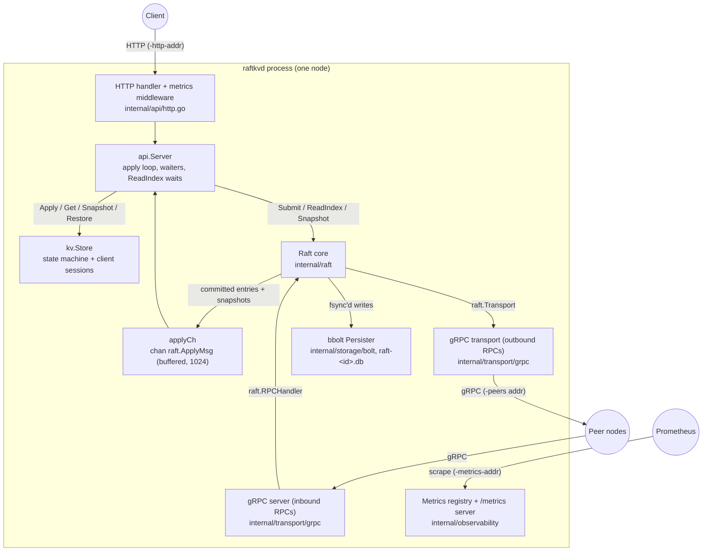

# Architecture

RaftKV is a replicated, strongly consistent key-value store built on a
from-scratch implementation of the Raft consensus protocol in Go. This document
describes how a `raftkvd` node is put together and how the pieces interact:
the two interfaces that decouple the Raft core from its environment, the full
write and read paths, persistence, snapshotting, client sessions, and the
concurrency model.

Related documents: [README](../README.md) ·
[Raft implementation details](raft.md) · [Client API](api.md) ·
[Operations](operations.md) · [Testing](testing.md)

## 1. Overview

A single `raftkvd` process hosts one node: the Raft core, its durable store,
the KV state machine, the client-facing HTTP API, the inter-node gRPC
endpoints, and a Prometheus metrics server. Cluster membership is static: every
node is started with the same `-peers` list (see [operations.md](operations.md)).



The wiring lives in `cmd/raftkvd/main.go`: it opens the bbolt file
(`raft-<id>.db` under `-data-dir`), constructs the Raft core with the gRPC
transport and a 1024-buffered `applyCh`, starts `api.NewServer` consuming that
channel into a `kv.Store`, and serves three listeners — the gRPC RPC endpoint,
the HTTP client API (wrapped in `Metrics.InstrumentHTTP`), and `/metrics`. A
background ticker pushes `Raft.Stats()` into the gauges
(`raftkv_current_term`, `raftkv_is_leader`, `raftkv_commit_index`,
`raftkv_last_applied`, `raftkv_log_bytes`) once per second.

## 2. The two interfaces: Transport and Persister

The Raft core (`internal/raft`) depends on exactly two interfaces, both
defined in that package. This seam is the central design decision: the same
core code passes deterministic, adversarial in-process tests *and* runs a real
networked cluster, purely by swapping implementations. The gRPC transport
dropped in during Phase 6 and passed the same election-and-replication checks
as the in-memory one (`TestGRPCReplication`,
`internal/transport/grpc/grpc_test.go`) with zero changes to the core.

### Transport (outbound) and RPCHandler (inbound)

From `internal/raft/transport.go`:

```go
type Transport interface {
    SendRequestVote(ctx context.Context, peer int, args *RequestVoteArgs) (*RequestVoteReply, error)
    SendAppendEntries(ctx context.Context, peer int, args *AppendEntriesArgs) (*AppendEntriesReply, error)
    SendInstallSnapshot(ctx context.Context, peer int, args *InstallSnapshotArgs) (*InstallSnapshotReply, error)
}

type RPCHandler interface {
    HandleRequestVote(args *RequestVoteArgs) *RequestVoteReply
    HandleAppendEntries(args *AppendEntriesArgs) *AppendEntriesReply
    HandleInstallSnapshot(args *InstallSnapshotArgs) *InstallSnapshotReply
}
```

Each `Send*` call blocks until a reply arrives or the context is cancelled, so
the core always issues them from goroutines that do not hold its lock. An
unreachable peer returns `ErrUnreachable` — a normal condition the core
retries later. `*Raft` itself implements `RPCHandler`; a transport delivers
inbound RPCs by calling those methods on the destination node.

| Implementation | Package | Used for |
|---|---|---|
| In-memory network | `internal/transport/inmem` | Tests. Seeded fault injection: ~10% drop, 0–27 ms delay (which reorders), and partition via `SetConnected`. Every RPC is gob-cloned in transit to model wire serialization — sender and receiver never share memory. |
| gRPC | `internal/transport/grpc` | Deployment. Protobuf messages mirror the Figure 2 RPCs; the client side lazily dials peers by ID and caches connections. Connections are insecure (trusted network assumed); TLS is a future add. |

### Persister

From `internal/raft/persister.go`:

```go
type Persister interface {
    SaveHardState(hs HardState) error
    AppendEntries(entries []LogEntry) error
    TruncateSuffix(index uint64) error
    TruncatePrefix(index uint64) error
    SaveSnapshot(snap Snapshot) error
    Load() (PersistentState, error)
    LogBytes() uint64
    Close() error
}
```

The interface is deliberately *incremental* rather than "dump the whole
state": a real write-ahead log appends one entry at a time and must not
re-serialize the entire log on every commit. The durability contract is that a
persisting method must not return until the data is on stable storage
(fsync'd), because Raft calls these before responding to RPCs whose safety
depends on them.

| Implementation | Package | Used for |
|---|---|---|
| `MemPersister` | `internal/raft/mempersister.go` | Tests. No real durability, but the identical interface and semantics — including truncation — so the core is exercised without disk. |
| bbolt | `internal/storage/bolt` | Deployment. One bbolt file per node; every update transaction fsyncs. |

## 3. Write path, end to end

A `PUT /kv/{key}` on the leader takes this route
(`internal/api/http.go` → `internal/api/api.go` → `internal/raft/raft.go`):

1. The HTTP handler reads the body, extracts the client session from the
   `X-Client-Id` / `X-Seq-No` headers, and calls `Server.Put` with a 3-second
   request timeout.
2. `Server.Put` gob-encodes a `kv.Op{Type: OpPut, ...}` carrying the session
   and hands it to `Server.mutate`.
3. `mutate` calls `Raft.Submit` and registers a waiter keyed by the returned
   log index. If this node is not the leader, `Submit` reports so and the
   handler answers with a 307 redirect to the leader (when its URL is known
   from `-api-peers`) or 503 with an `X-Leader-Id` header.
4. `Submit` appends the entry to the in-memory log, persists it
   (`Persister.AppendEntries`, an fsync on bbolt), and broadcasts
   `AppendEntries` to all followers.
5. Followers run the log-matching check, persist the entries, and acknowledge.
   When a majority's `matchIndex` covers the entry (and its term is the
   leader's current term, the §5.4.2 rule in `maybeAdvanceCommit`), the leader
   advances the commit index and wakes the applier.
6. The applier goroutine delivers the committed entry on `applyCh` in strict
   log order. The `api.Server` apply loop calls `kv.Store.Apply` (which dedups
   retried sessions, §7), records the new applied index, and sends the result
   to the registered waiter.
7. `mutate` receives the result and — after checking that the entry which
   committed at its index still carries its term — returns; the handler writes
   `204 No Content`. If the term differs, a new leader overwrote the proposal:
   `mutate` returns `ErrNotLeader` and the client retries, which the session
   dedup makes safe.

### Waiter registration under the mutex

`mutate` registers its waiter *inside* `s.mu`, spanning the `Submit` call:

```go
s.mu.Lock()
index, term, isLeader := s.rf.Submit(cmd)
...
s.waiters[index] = ch
s.mu.Unlock()
```

The apply loop must take `s.mu` to deliver a result, so it cannot look up the
index, find no waiter, and drop the notification before registration
completes. Without this, a fast commit — notably a single-node cluster, where
`Submit` advances the commit index synchronously — could apply and notify
before the waiter existed, and a successfully committed write would spuriously
time out. This lost-wakeup race was found by adversarial review in Phase 5
(see `CLAUDE.md` §3, 2026-07-05). There is no deadlock: `Submit` never waits
on `s.mu`, and `applyCh` is buffered, so the applier feeding the loop cannot
block `Submit`. The waiter channel has buffer 1, so delivery under `s.mu`
never blocks the apply loop either.

## 4. Read path: ReadIndex

Reads are linearizable without writing anything to the log. `Server.Get` runs
the ReadIndex protocol (`Raft.ReadIndex` in `internal/raft/raft.go`):

1. **Readiness check.** The node must be leader, and the entry at its commit
   index must carry the current term. Until a current-term entry has
   committed, the leader cannot be sure its commit index reflects every entry
   committed by prior leaders (§8 of the Raft paper), so it refuses the read.
2. **Capture.** The current commit index becomes the read index.
3. **Quorum confirmation.** `confirmQuorum` sends one heartbeat round; the
   read proceeds only once a majority (including self) acknowledges this
   leader at this term. That proves no newer leader exists, so no write the
   reader could miss has been acknowledged elsewhere.
4. **Wait for apply.** `Server.waitApplied` blocks (2 ms poll) until the local
   state machine has applied through the read index.
5. **Read.** The value is read from `kv.Store` and returned.

Any failure — not leader, no current-term commit, quorum unconfirmed — yields
`ErrNotLeader` and a redirect, never a stale answer. `TestNoStaleRead`
(`internal/api/api_test.go`) verifies that a leader isolated in a minority
partition refuses the read while the majority's new leader serves the fresh
value. The end-to-end guarantee is checked with Porcupine
(`TestLinearizability`, `internal/api/linearizability_test.go`): 210
concurrent operations (3 writers × 30 appends, 3 readers × 40 gets) across 3
keys verified linearizable against a per-key register model, 3 runs under
`-race`.

### The no-op election barrier

`becomeLeader` immediately appends and replicates a `LogEntry{NoOp: true}` in
its new term. This one entry does two jobs:

- **Commit-index freshness for ReadIndex.** Once the no-op commits, the
  entry at the commit index has the current term, so the readiness check in
  step 1 passes and the leader can serve linearizable reads.
- **Immediate re-apply of prior-term entries.** A leader may not count
  replicas of prior-term entries toward commitment (§5.4.2); committing the
  current-term no-op transitively commits every earlier entry, so entries
  recovered from a previous term apply as soon as a leader is elected rather
  than waiting for the next client write.

The state machine ignores the entry (the apply loop skips `NoOp` messages) but
still advances its applied index past it.

## 5. Persistence

The bbolt persister (`internal/storage/bolt/bolt.go`) stores everything in one
file per node with three buckets:

| Bucket | Keys | Values |
|---|---|---|
| `meta` | `hardstate` | gob-encoded `HardState` (current term + voted-for) |
| `log` | big-endian `uint64` log index | gob-encoded `LogEntry` |
| `snap` | `snapshot` | gob-encoded `Snapshot` (last included index/term + state machine bytes) |

Big-endian index keys make bbolt's key order the log order, so `Load` streams
entries back ascending and the truncation methods are cursor range-deletes.
bbolt fsyncs on every update transaction, so each `SaveHardState`,
`AppendEntries`, `TruncateSuffix`, `TruncatePrefix`, and `SaveSnapshot` call
is durable when it returns — this is what puts an fsync on the commit path and
dominates the measured write latency (p50 32 ms on the 5-node compose
cluster; see [README](../README.md)).

**What is persisted when.** The hard state is saved at every term or vote
change (`startElection`, `stepDownIfBehind`, vote grants). Log entries are
persisted in `Submit` before replication begins, and in
`HandleAppendEntries` before the follower acknowledges success — never
ack-then-persist.

**Persist-ordering invariant.** Hard state and log writes are separate bbolt
transactions, not one atomic write. This is crash-safe because the current
term is always fsync'd *before* any log entry of that term is persisted (the
term changes in `startElection`/`stepDownIfBehind`, which persist immediately;
entries of that term are only appended afterwards). A crash between the two
transactions can therefore only lose the log append — harmless, the leader
resends — and can never leave a persisted entry whose term exceeds the
persisted current term. Crash recovery is exercised by
`TestFollowerCrashRecovery`, `TestLeaderCrashRecovery`, and
`TestWholeClusterRestart` (`test/persistence_test.go`).

**Persist-under-lock trade-off.** Persister calls run while holding the Raft
mutex, so a bbolt fsync briefly blocks the node's other RPC handlers. This is
deliberate: it is the price of durability on the critical path, and it is a
throughput lever (batching/pipelining), not a correctness issue. It remains a
known deferred item.

## 6. Snapshotting and log compaction

**The boundary sentinel.** `log[0]` is not a real entry: its `Index` is the
last snapshotted index, called `base()` (0 when no snapshot exists). The
invariant `log[i].Index == base()+i` holds throughout, and an absolute index
`a` maps to slice position `a - base()`. Entries at or below `base()` exist
only inside the snapshot.

**Triggering.** Compaction is application-driven. The `api.Server` apply loop
checks `Raft.LogSize()` (the persister's approximate on-disk log bytes) after
each apply; past the `-snap-bytes` threshold (default 1 MiB, 0 disables) it
calls `Raft.Snapshot(appliedIndex, store.Snapshot())`. Because the apply loop
is the sole applier, the store's contents correspond exactly to that index.
`Raft.Snapshot` re-bases the in-memory log, saves the snapshot, then truncates
the persisted prefix. `TestSnapshotBoundsLog` (`test/snapshot_test.go`) shows
the log stays bounded under sustained writes.

**InstallSnapshot.** When a follower's `nextIndex` falls at or below the
leader's `base()`, the entries it needs have been compacted away, so
`replicateTo` ships the snapshot instead. The follower
(`HandleInstallSnapshot`) keeps a matching log suffix beyond the snapshot if
one exists, otherwise discards its log entirely, persists the snapshot, and
hands it to the state machine through `applyCh`
(`ApplyMsg{SnapshotValid: true}`), which `kv.Store.Restore` installs.
Verified by `TestInstallSnapshotCatchup`; restart-from-snapshot by
`TestRestartFromSnapshot` (`test/snapshot_test.go`).

**Torn-snapshot recovery.** Saving a snapshot and truncating the log are
separate fsync'd transactions (snapshot first, so nothing is ever lost). A
crash between them leaves both the snapshot and the not-yet-truncated log
prefix on disk. `raft.New` tolerates this with a contiguous-suffix rule: after
loading, it keeps only persisted entries that form a contiguous run starting
at `base()+1` — entries the snapshot already covers are dropped, and loading
stops at any gap rather than reconstructing a non-contiguous log. Appending
the stale prefix verbatim would silently break the `log[i].Index == base()+i`
invariant. This bug was found by adversarial review in Phase 4 and is pinned
by the white-box regression test `TestRecoverTornSnapshot`
(`internal/raft/recover_test.go`), which constructs the exact torn on-disk
state.

## 7. Client sessions and exactly-once semantics

Every mutating command carries a client session: `kv.Op` includes `ClientID`
and `SeqNo` (from the `X-Client-Id` / `X-Seq-No` HTTP headers). The state
machine (`kv.Store.Apply`) keeps a per-client session record — the last
applied `SeqNo` and its cached `Result`. If a command arrives whose `SeqNo` is
at or below the client's last applied one, the state is left untouched and the
cached result is returned. A command committed twice — for example, a leader
crashes after committing but before replying, and the client retries against
the new leader — therefore mutates the state exactly once
(`TestExactlyOnceRetry`, `internal/api/api_test.go`).

Two details matter:

- **Dedup is gated on a non-empty `ClientID`, not on `SeqNo`.** `SeqNo` 0 is a
  valid first sequence number; gating on it would silently disable
  exactly-once for a client that 0-indexes its requests (or omits the header).
  This gap was found in the Phase 5 review and is pinned by `TestZeroSeqDedup`.
- **The session table is part of the snapshot.** `kv.Store.Snapshot` encodes
  both the data map and the sessions map, so exactly-once survives log
  compaction and restart-from-snapshot — a duplicate arriving after the
  original was compacted away is still recognized.

The `append` operation exists partly for verification: it is non-idempotent,
so a double-apply is observable in state, which the exactly-once tests and the
Porcupine check rely on.

## 8. Concurrency model

Per node, the moving parts are deliberately few:

- **One background loop** (`Raft.run`) wakes every 12 ms and does both jobs:
  fires an election when the randomized 150–300 ms election deadline passes
  (follower/candidate), and sends heartbeats every 50 ms (leader). A single
  loop avoids the dynamic `WaitGroup.Add` races of separate
  per-role goroutines.
- **One applier goroutine** (`Raft.applier`) sleeps on a `sync.Cond` tied to
  the Raft mutex and wakes when the commit index advances or a snapshot
  arrives. It delivers `ApplyMsg`s in strict order — a pending snapshot always
  before any later command — and releases the mutex while sending on
  `applyCh`, so a slow consumer never blocks the core's RPC handlers.
- **One goroutine per outbound RPC.** `broadcastAppendEntries`,
  `startElection`, and `confirmQuorum` spawn a goroutine per peer; each sends
  off-lock, then re-acquires the mutex to process the reply, first applying
  the step-down-on-higher-term rule and discarding the reply if the role or
  term has changed since the send. Election and replication RPCs are
  fire-and-forget with `context.Background()` — they rely on the transport to
  fail unreachable peers rather than on cancellation. This is a known,
  deliberately deferred item (`CLAUDE.md` §5); `confirmQuorum` is the
  exception and does honor the caller's context, because a read is waiting
  on it.
- **The API layer** adds one apply-loop goroutine (`api.Server.applyLoop`) and
  per-request handler goroutines (standard `net/http`). Handler goroutines
  never touch Raft state directly: writes park on waiter channels, reads park
  in `waitApplied`.

All mutable Raft state is guarded by a single mutex per node; the two
cross-goroutine handoffs are `applyCh` (core → API) and the waiter channels
(apply loop → parked request handlers). The entire suite runs under
`go test -race ./...` (see [testing.md](testing.md)).
