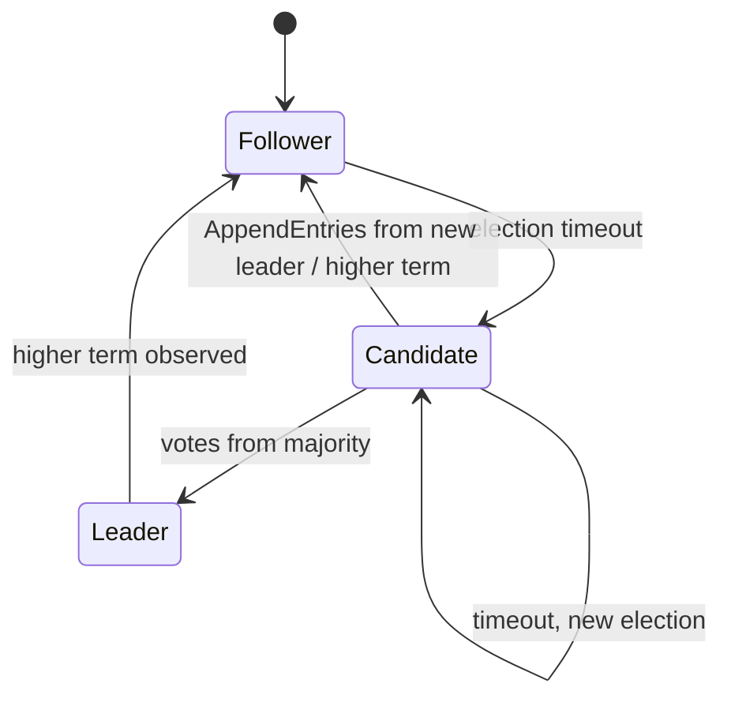

# The Raft implementation

How RaftKV implements the Raft consensus protocol, how faithfully it follows
the paper, and how each safety claim is verified. For the surrounding system
(transports, persistence, API) see [architecture.md](architecture.md); for the
test methodology see [testing.md](testing.md); overview in
[../README.md](../README.md).

All references are to Ongaro & Ousterhout, *In Search of an Understandable
Consensus Algorithm* (the Raft paper), and to Ongaro's PhD thesis where noted.
The core lives in `internal/raft/` — chiefly `raft.go` (state machine, timers,
replication, commit) and `rpc.go` (the three inbound RPC handlers).

## 1. Fidelity statement

The core follows the paper's **Figure 2 exactly**: the same persistent and
volatile state, the same RPC arguments and receiver rules, the same rules for
servers, including the details that are easy to get subtly wrong (the §5.4.1
vote restriction, the §5.4.2 own-term commit rule, the "min with index of last
*new* entry" bound on a follower's commit index, and step-down on a higher
term observed in *any* RPC request or response).

Everything beyond Figure 2 is a deliberate extension, each taken from the
paper or thesis and listed in section 3: fast conflict backup, the
no-op-on-election barrier, ReadIndex reads, InstallSnapshot (paper §7,
Figure 13), and client sessions (paper §8). One implementation convention is
worth naming up front: the in-memory log carries a **boundary sentinel at
slice position 0** whose `Index` is the last snapshotted index (`base()`), so
`log[i].Index == base() + i` and log indices are 1-based throughout. With no
snapshot, `base() == 0` and the layout is exactly the paper's.

## 2. Figure 2 mapping

Every rule and field in Figure 2, and where it is implemented. All paths are
relative to `internal/raft/`.

| Figure 2 item | Implementation |
|---|---|
| **Persistent state**: `currentTerm`, `votedFor`, `log[]` | `Raft` struct fields (`raft.go`); persisted via `persist()` → `Persister.SaveHardState`, `persistAppend()`, `persistTruncateSuffix()`; reloaded in `New()` (`raft.go`) |
| Persist before responding | `startElection` and `stepDownIfBehind` call `persist()` before any RPC is answered or sent for the new term; `Submit` and `HandleAppendEntries` persist log mutations before acking |
| **Volatile state (all nodes)**: `commitIndex`, `lastApplied` | `Raft.commitIndex`, `Raft.lastApplied` (`raft.go`) |
| **Volatile state (leaders)**: `nextIndex[]`, `matchIndex[]` | `Raft.nextIndex`, `Raft.matchIndex`; reinitialized in `becomeLeader()` (`raft.go`) |
| **RequestVote** rule 1: reply false if `term < currentTerm` | `HandleRequestVote` (`rpc.go`) |
| **RequestVote** rule 2: grant if `votedFor` is null or candidate, and candidate's log is at least as up-to-date (§5.4.1) | `HandleRequestVote` + `candidateUpToDate()` (`raft.go`): compare last-entry terms, then lengths on a tie |
| **AppendEntries** rule 1: reply false if `term < currentTerm` | `HandleAppendEntries` (`rpc.go`) |
| **AppendEntries** rule 2: reply false if the log has no entry at `prevLogIndex` matching `prevLogTerm` (Log Matching check) | `HandleAppendEntries` (`rpc.go`); the rejection also fills the fast-backup hints (section 3) |
| **AppendEntries** rule 3: on a conflicting existing entry (same index, different term), delete it and all that follow | The splice loop in `HandleAppendEntries`: it truncates **only at the first genuine conflict** — matching entries are skipped, never re-truncated, so a stale or duplicated RPC cannot erase entries a later RPC appended |
| **AppendEntries** rule 4: append entries not already in the log | Same splice loop |
| **AppendEntries** rule 5: `commitIndex = min(leaderCommit, index of last new entry)` | End of `HandleAppendEntries`; the bound is the last *new* entry (`prevLogIndex + len(entries)`), not the follower's last index — Figure-2-exact |
| **All servers**: apply `log[lastApplied+1 .. commitIndex]` in order | `applier()` goroutine (`raft.go`), woken by `applyCond`; delivers `ApplyMsg`s in strict index order |
| **All servers**: on any RPC request *or response* with term `T > currentTerm`, set `currentTerm = T`, convert to follower | `stepDownIfBehind()` (`raft.go`) — called first in all three handlers (`rpc.go`) and on every RPC reply (`startElection` vote replies, `replicateTo`, `confirmQuorum`). It also resets the election timer (see the bug log, section 6) |
| **Followers**: election timeout without valid RPC → become candidate | `run()` loop checks `electionDeadline` every tick → `startElection()`; `HandleRequestVote` (on grant), `HandleAppendEntries`, and `HandleInstallSnapshot` reset the timer |
| **Candidates**: increment term, vote self, reset timer, send RequestVote to all | `startElection()` (`raft.go`) |
| **Candidates**: majority of votes → leader | Vote-reply goroutines in `startElection` count votes → `becomeLeader()`; a single-node cluster wins immediately inside `startElection` (see bug log) |
| **Candidates**: AppendEntries from a legitimate leader → follower | `HandleAppendEntries` sets `role = Follower` for any `term >= currentTerm` |
| **Leaders**: heartbeats on idle | `run()` calls `broadcastAppendEntries()` every `heartbeatInterval` |
| **Leaders**: append client command, replicate, respond after apply | `Submit()` (`raft.go`); the API layer waits for the apply (see [api.md](api.md)) |
| **Leaders**: if `lastLogIndex >= nextIndex[peer]`, send entries from `nextIndex`; on success update `nextIndex`/`matchIndex`; on failure decrement and retry | `replicateTo()` (`raft.go`); "decrement" is accelerated by `backupIndex()` (section 3) |
| **Leaders**: advance `commitIndex` to the highest `N` with a majority of `matchIndex >= N` **and `log[N].term == currentTerm`** (§5.4.2) | `maybeAdvanceCommit()` (`raft.go`): scans down from the last index, stops at the first entry not from the current term |

## 3. Extensions beyond Figure 2

Each extension comes from the paper or thesis, not invention.

**Fast conflict backup** (`ConflictTerm`/`ConflictIndex`). The paper (§5.3)
notes the one-entry-per-round-trip `nextIndex` decrement can be optimized so a
rejection backs the leader up a full term at a time. On rejection,
`HandleAppendEntries` reports the conflicting entry's term and the first index
it holds for that term (or `ConflictTerm == 0` and `ConflictIndex = last + 1`
when the follower's log is simply too short); the leader's `backupIndex()`
(`raft.go`) uses the hints to skip the whole term. Rationale: after a
partition heals, a follower can be thousands of entries behind — linear
backup would stall recovery.

**No-op-on-election barrier.** `becomeLeader()` immediately appends and
replicates a `LogEntry{NoOp: true}`. Per §5.4.2 a leader may never *count
replicas* of prior-term entries toward commitment, so without a current-term
entry a new leader's `commitIndex` can lag arbitrarily; the paper's §8 fix is
to commit a blank no-op at the start of the term. This makes recovered
prior-term entries commit (and re-apply) immediately, and is what makes
ReadIndex possible. The state machine skips it (`ApplyMsg.NoOp`).

**ReadIndex linearizable reads** (paper §8; thesis §6.4). `Raft.ReadIndex()`
(`raft.go`) refuses unless a current-term entry is committed (the no-op),
captures `commitIndex`, then `confirmQuorum()` runs one heartbeat round to
prove no newer leader exists. The caller (`api.Server.Get`) waits until the
state machine has applied through that index before reading. Rationale: reads
never touch the log (no write amplification) yet can never return a value
older than the latest acknowledged write — verified by `TestNoStaleRead` (a
leader isolated in a minority refuses the read) and `TestLinearizability`
(Porcupine, see [testing.md](testing.md)).

**InstallSnapshot** (paper §7, Figure 13). When log compaction has discarded
entries a slow follower still needs (`nextIndex[peer] <= base()`),
`replicateTo` ships the snapshot instead; `HandleInstallSnapshot` (`rpc.go`)
installs it, keeping a matching log suffix if one exists, and hands the
snapshot to the state machine via the apply channel. Verified by
`TestInstallSnapshotCatchup` and `TestRestartFromSnapshot`
(`test/snapshot_test.go`).

**Client sessions / exactly-once** (paper §8; thesis §6.3). Raft alone gives
at-least-once: a leader can commit a command, crash before replying, and the
client's retry commits it again. Each mutating command carries a
`(ClientID, SeqNo)`; the state machine (`internal/kv/kv.go`, `Store.Apply`)
remembers the last `SeqNo` and its cached result per client and returns the
cache for duplicates. The session table is included in snapshots so dedup
survives compaction, and dedup is gated on a non-empty `ClientID` (`SeqNo 0`
is a valid first sequence number — see the bug log). Verified by
`TestExactlyOnceRetry` and `TestZeroSeqDedup` (`internal/api/api_test.go`).

## 4. Safety invariants

The five properties of the paper's Figure 3, where each is enforced, and the
named test that would fail if it broke.

| Invariant | Meaning | Enforced by | Asserted by |
|---|---|---|---|
| Election Safety | At most one leader per term | One persisted vote per term (`HandleRequestVote` + `persist()`); majority vote count (`startElection`) | `checkOneLeader` (`test/harness_test.go`) fails on two leaders in a term; run in every election/replication test, e.g. `TestInitialElection`, `TestElection5Nodes`, `TestReElection`, `TestElectionUnreliable` |
| Leader Append-Only | A leader never overwrites or deletes its own log entries | Structural: the only leader-side log mutations are appends (`Submit`, `becomeLeader`) and snapshot compaction (`Raft.Snapshot`, which only discards committed, snapshot-covered prefix entries — never overwrites or removes a suffix); suffix truncation/overwrite exists only in follower paths (`HandleAppendEntries`, `HandleInstallSnapshot`), both of which first set `role = Follower` | No dedicated test; violations would surface as State Machine Safety failures in the harness apply oracle (below) |
| Log Matching | Entries with the same index and term are identical, and so are all preceding entries | The `prevLogIndex`/`prevLogTerm` consistency check in `HandleAppendEntries`; truncate-only-on-genuine-conflict splice | In-order, gap-free apply checks in the harness `drain` (`test/harness_test.go`); `TestBasicAgreement`, `TestDeposedLeaderEntriesOverwritten` |
| Leader Completeness | A committed entry is present in the log of every later-term leader | §5.4.1 vote restriction (`candidateUpToDate`) + §5.4.2 own-term commit rule (`maybeAdvanceCommit`) | `TestLeaderChangeKeepsCommitted` (`test/replication_test.go`); `chaos/partition.sh` verifies a unique per-run committed value survives a leader partition and heal on a live 5-node cluster |
| State Machine Safety | No two nodes apply different commands at the same log index | Consequence of the above plus the strictly ordered `applier()` | The harness `drain` keeps a shared `committed` oracle and fails on any divergent apply ("State Machine Safety violated"); `checkStoresAgree` (`test/snapshot_test.go`) requires full state-machine convergence; `TestLinearizability` checks 210 concurrent ops with Porcupine |

## 5. Randomized timeouts and liveness

Timing constants (`internal/raft/raft.go`):

| Constant | Value |
|---|---|
| `electionTimeoutMin` / `Max` | randomized per reset in [150 ms, 300 ms) |
| `heartbeatInterval` | 50 ms |
| `tickInterval` (background loop wake) | 12 ms |

Randomization (`resetElectionTimer`, seeded per node) is the paper's §5.2
split-vote defense; the 3x gap between heartbeat and minimum election timeout
means a live leader always refreshes followers first.
`TestElectionUnreliable` (`test/election_test.go`) holds a single stable
leader on 5 nodes under the in-memory network's fault model (~10% message
drop, 0–27 ms random delay — `internal/transport/inmem`), with bounded term
growth over the observation window.

**An honest liveness caveat.** During Phase 7 chaos testing, after many
back-to-back kill/partition/heal cycles, the live Docker-on-Windows 5-node
cluster fell into a persistent election storm — terms climbing ~6–7 per
second, no stable leader, writes failing with 503. The storm survived
`docker compose restart` (the persisted high term reloads and the churn
resumes) but a fresh `down -v` + `up` was immediately stable at term 1. The
trigger is environmental: accumulated churn colliding with
Docker-on-Windows heartbeat-latency spikes against the 150–300 ms election
timeout (split-vote livelock), not a normal-operation defect — the same core
is stable at term 1 on every fresh start and passes all deterministic in-mem
chaos tests. Two known levers, deliberately not yet pulled: scale the
election timeout up for high-latency deployments, and add Pre-Vote (thesis
§9.6) so a node that cannot win an election cannot bump the cluster's term.

## 6. Notable bugs found and fixed

Phases 1–5 each ended with an adversarial multi-lens review (phases 6–7 were
verified by their acceptance runs and the chaos scripts instead); these are the
real defects the reviews (or writing a test) surfaced. Full narrative in the
project changelog ([../CHANGELOG.md](../CHANGELOG.md)).

| Bug | Symptom | Root cause | Fix | Regression test |
|---|---|---|---|---|
| Timer reset on step-down (Phase 1) | A leader learning of a higher term via an RPC *reply* would re-campaign on the next ~12 ms tick | `stepDownIfBehind` converted to follower without resetting the election timer; a leader's deadline is always stale | Reset the timer inside `stepDownIfBehind` (the shared choke point) | None deterministic — the inbound-RPC path masks it and a razor-sharp repro needs a virtual clock (deferred); the fix is correct Figure 2 regardless |
| Single-node election and commit (Phase 2) | An N=1 cluster never elected itself and never advanced `commitIndex` | Majority checks lived only in per-peer reply goroutines, of which N=1 spawns none | Immediate self-win in `startElection`; `maybeAdvanceCommit` called from `Submit` | `TestSingleNode` (`test/replication_test.go`) |
| Torn-snapshot recovery (Phase 4) | Crash between `SaveSnapshot` and the log truncation left snapshot-covered entries on disk; `New()` re-appended them verbatim, silently breaking `log[i].Index == base()+i` | Snapshot and truncation are separate transactions (correctly ordered), but the *reload* path did not tolerate the torn state that ordering permits | `New()` keeps only a contiguous suffix starting past `base()`, dropping covered entries and stopping at any gap | `TestRecoverTornSnapshot` (`internal/raft/recover_test.go`) builds the exact torn on-disk state |
| Lost-wakeup waiter race (Phase 5) | A fast-committing write (notably N=1, where `Submit` commits synchronously) could apply-and-notify before the API registered its waiter → committed write spuriously timed out | `api.Server.mutate` registered the result waiter *after* `Submit` returned | Register the waiter under `s.mu` spanning `Submit`; the apply loop needs `s.mu` to deliver, so it blocks until registration (no deadlock: `Submit` never takes `s.mu`) | Narrow window not reliably triggered by `TestSingleNodeAPI`; fix verified by review and code inspection |
| Zero-seq dedup gap (Phase 5) | Exactly-once silently disabled for a client whose first request used `SeqNo 0` | Dedup was gated on `SeqNo != 0` instead of session presence | Gate on a non-empty `ClientID` alone | `TestZeroSeqDedup` (`internal/api/api_test.go`) — reliably reproduced the double-apply before the fix |

## 7. Known trade-offs

Deliberate, documented, and not correctness issues.

- **Persistence runs under the node lock.** `persist()`/`persistAppend()` are
  called while holding `r.mu`, so a bbolt fsync briefly blocks that node's
  other RPC handlers. This is the price of durability on the commit path
  (visible in the ~32 ms p50 write latency; see
  [operations.md](operations.md)). Batching/group-commit is a future
  performance lever, not a correctness need — the crucial ordering property
  (term fsync'd before any log entry of that term) is what makes the separate
  transactions crash-safe.
- **Outbound RPCs are fire-and-forget with `context.Background()`.**
  `replicateTo` and the vote senders spawn goroutines that block on the
  transport with no deadline; a hung peer costs a goroutine, not progress
  (replies are re-checked against the current term before use). Bounding them
  is deferred.
- **No virtual clock.** Timers are wall-clock, so timing-sensitive tests poll
  with generous windows instead of stepping time deterministically. The one
  bug this cost a repro for is the timer-reset fix above; a virtual clock is
  deferred.

See also: [architecture.md](architecture.md) for the Transport/Persister
interfaces the core is written against, [api.md](api.md) for the client-facing
consistency contract, [testing.md](testing.md) for the harness and chaos
methodology, and [operations.md](operations.md) for running a cluster.
