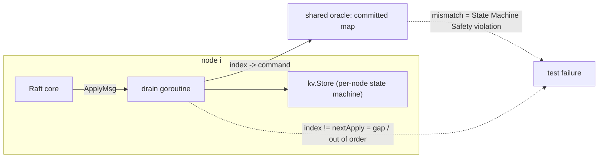

# Testing and verification

RaftKV's correctness claims are the project's core deliverable. This document
describes how those claims are earned: a deterministic fault-injecting test
harness, a Porcupine linearizability check, live Docker chaos scripts, and an
adversarial review process that found real bugs in four of seven phases.

Related: [README](../README.md) · [architecture.md](architecture.md) ·
[raft.md](raft.md) · [api.md](api.md) · [operations.md](operations.md)

---

## 1. Philosophy: failures must reproduce

A distributed-systems bug that cannot be replayed cannot be fixed with
confidence. Three rules follow from that:

1. **Deterministic, seedable network.** All core tests run on the in-process
   transport (`internal/transport/inmem`), a simulated network whose fault
   decisions are driven by a seeded RNG. In unreliable mode it injects, per
   RPC: **~10% message drop** (`rng.Intn(100) < 10`) and **a random delay
   drawn from [0, 27) ms** (`rng.Intn(27)` milliseconds), which also reorders
   concurrent messages; partitions are injected with `SetConnected`. Every
   RPC's args and reply are **gob-cloned** in transit, modelling wire
   serialization so sender and receiver never share memory — this catches
   accidental aliasing and keeps the race detector honest. One honesty
   caveat, stated in the package documentation itself: fault *decisions*
   are reproducible from the seed, but goroutine scheduling is not, so tests
   assert properties over time windows (e.g. bounded term growth) rather
   than exact interleavings.
2. **`-race` on everything.** `go test -race ./...` is the merge gate, run
   locally and in CI (`.github/workflows/ci.yml`: gofmt-check, `go vet`,
   build, `go test -race` on every push and PR). A data race is a bug, not a
   warning.
3. **Repeat runs gate every phase.** No phase was tagged with a flaky test:
   Phase 1 was repeated 5x under `-race` with no flakiness; Phases 2–5 were
   repeated 2x each; the Porcupine check ran 3x under `-race`.

## 2. The harness (`test/harness_test.go`)

The harness builds an N-node cluster on the in-mem network and pins safety
invariants directly into the plumbing, so *every* test asserts them as a side
effect of running.



| Piece | What it does |
|---|---|
| `drain` (per node) | Consumes the node's apply channel; asserts **State Machine Safety** (no two nodes apply different commands at the same log index, via a shared `committed` oracle) and **gap-free, in-order apply** (`nextApply` counter); applies commands to that node's `kv.Store`; restores from snapshots; triggers compaction past the byte threshold. |
| `checkOneLeader` | Asserts **Election Safety** (no term has two leaders — `Fatalf` if any term does) and returns the leader of the highest term; polls up to ~3 s so a loaded CI runner does not spuriously report "no leader" mid-election. |
| `checkNoLeader` | Fails if any connected node believes it is leader (minority-partition tests). |
| `checkTerms` | Asserts all connected nodes converge on a single term (term propagation via heartbeats). |
| `one(cmd, expectedServers, retry)` | MIT-6.5840-style: submits through the current leader, retries through leader changes, and waits until at least `expectedServers` nodes committed the command at the same index. Goroutine-safe (`Errorf`, not `Fatalf`). |
| `nCommitted(index)` | How many nodes applied the entry at `index`, plus the agreed command there. |
| `crashAndRestart(i)` | Simulated `kill -9`: stop node `i`, close and reopen its persister, start a fresh Raft that must recover its log from durable state. |
| `crashAllAndRestart()` | Whole-cluster outage: every node killed, then restarted. Nothing is alive to serve the recovered nodes, so committed data must come entirely from disk. |
| Pluggable persister factory | `makeCluster` (in-memory `MemPersister`, same object across restarts), `makeClusterBolt` (real bbolt files under a temp dir — restart genuinely reloads from disk), `makeClusterBoltSnap` (adds a snapshot byte threshold for compaction tests). |
| `checkStoresAgree` | Waits for every node's state machine to converge to identical contents — State Machine Safety across mixed command and snapshot applies (`test/snapshot_test.go`). |
| `applyAll` | Replays the agreed committed log in index order into a fresh store and asserts **Log Matching** (no gap in the committed prefix, election no-op indices excepted) (`test/replication_test.go`). |

## 3. Test inventory

Every test below is real and current; run `go test -race ./...` to execute
all of them.

| File | Test | Purpose |
|---|---|---|
| `test/smoke_test.go` | `TestInmemRoundTrip` | Transport plumbing: registered peer answers, unregistered peer is unreachable, concurrent sends are race-free. |
| `test/election_test.go` | `TestInitialElection` | Fresh 3-node cluster elects exactly one leader. |
| | `TestElection5Nodes` | 5-node cluster elects exactly one leader. |
| | `TestTermAgreement` | Every connected node adopts the leader's term. |
| | `TestReElection` | Leader isolated → new leader in a higher term; rejoin creates no second leader; a minority cannot elect; restored quorum elects again. |
| | `TestElectionUnreliable` | Single stable leader under ~10% drop + delays; bounded term growth over a 900 ms window. |
| | `TestNoChurnOnRejoin` | A follower with an inflated term rejoins without churning the cluster's term. |
| `test/replication_test.go` | `TestSingleNode` | N=1 cluster elects itself and advances its own commit index. |
| | `TestBasicAgreement` | Writes replicate to every node at contiguous, in-order indices. |
| | `TestAgreementWithFollowerDown` | Majority commits with one follower partitioned; follower catches up on reconnect. |
| | `TestLeaderChangeKeepsCommitted` | Losing the leader mid-workload loses no committed entry. |
| | `TestDeposedLeaderEntriesOverwritten` | An isolated leader's uncommitted entries are overwritten on rejoin. |
| | `TestConcurrentSubmits` | 25 concurrent writers all commit; drains assert identical apply order. |
| | `TestKVStateMachine` | Put/CAS/Delete apply deterministically (CAS on an absent key is a no-op). |
| `test/persistence_test.go` | `TestFollowerCrashRecovery` | Killed follower recovers its log from disk and rejoins. |
| | `TestLeaderCrashRecovery` | Killed leader loses no committed data; cluster re-elects. |
| | `TestWholeClusterRestart` | Full-cluster crash: committed data survives entirely from disk. |
| | `TestSingleNodeCrashRecovery` | N=1 committed writes survive a crash. |
| `test/snapshot_test.go` | `TestSnapshotBoundsLog` | Log stays bounded under sustained writes with compaction enabled. |
| | `TestInstallSnapshotCatchup` | A follower whose needed prefix was compacted is caught up via `InstallSnapshot`. |
| | `TestRestartFromSnapshot` | Restart rebuilds the state machine from the on-disk snapshot plus log tail. |
| `internal/raft/recover_test.go` | `TestRecoverTornSnapshot` | White-box: a crash between `SaveSnapshot` and log truncation leaves a torn on-disk state; `New` must reconcile to a contiguous log (regression for the Phase 4 bug, §6). |
| `internal/storage/bolt/bolt_test.go` | `TestPersisterRoundTrip` | Hard state, log, and snapshot survive close + reopen of the bbolt file. |
| | `TestTruncateSuffix` | Drops entries with index >= the given index. |
| | `TestTruncatePrefix` | Drops entries with index < the given index. |
| `internal/transport/grpc/grpc_test.go` | `TestGRPCReplication` | Real 3-node gRPC cluster on localhost elects a leader and replicates committed writes to every node — the gRPC transport is interchangeable with the in-mem one. |
| `internal/api/api_test.go` | `TestExactlyOnceRetry` | Re-submitting the same `(clientID, seqNo)` applies once (Append makes a double-apply visible). |
| | `TestSingleNodeAPI` | N=1 fast-commit path works end to end (exercises, but does not reliably trigger, the lost-wakeup window of §6). |
| | `TestZeroSeqDedup` | A client whose sequence numbers start at 0 still gets exactly-once (regression, §6). |
| | `TestNoStaleRead` | A leader isolated into a minority refuses reads (ReadIndex quorum fails); the majority's leader serves the fresh value. |
| | `TestWriteToFollowerRedirects` | A write to a non-leader returns `ErrNotLeader` plus the correct leader hint. |
| | `TestHTTPRoundTrip` | HTTP handler end-to-end: PUT with session headers → 204; GET → the value. |
| `internal/api/linearizability_test.go` | `TestLinearizability` | Porcupine check on a concurrent history (§4). |

## 4. Linearizability checking (Porcupine)

`TestLinearizability` (`internal/api/linearizability_test.go`) drives a
3-node in-mem cluster through the real API servers and checks the recorded
history with [Porcupine](https://github.com/anishathalye/porcupine)
(`github.com/anishathalye/porcupine`).

**History recording.** 3 writer goroutines each issue 30 `Append` operations
(90 writes) and 3 reader goroutines each issue 40 linearizable `Get`
operations (120 reads) — **210 operations across 3 keys** (`x`, `y`, `z`).
Each operation records its client ID, input, output, and wall-clock call and
return timestamps. Operations retry against the current leader until they
succeed, so leader changes are exercised, not avoided.

**Model.** A per-key register supporting get/put/append. The model is
partitioned by key (linearizability is compositional: a history is
linearizable iff each per-key subhistory is), which keeps the check
tractable. Only `Get`'s output is constrained — it must observe exactly the
current register value; `Append` transforms the state by concatenation, so
any lost, duplicated, or reordered append corrupts the value every later
read must match.

**Why retries do not poison the history.** Writers retry on leader change,
but each append carries an exactly-once session identity `(clientID, seqNo)`.
The state machine dedups retries (see [api.md](api.md)), so each logical
append appears in the applied state exactly once — the recorded history
matches what the store actually did.

**Verdicts.** `porcupine.CheckOperationsTimeout` (30 s budget) returns one of
three results. `Ok` means a legal sequential ordering of all 210 operations
exists that respects real-time order. `Illegal` fails the test: it would be
machine-checked proof of a consistency violation — a stale read, a lost or
doubly-applied append, or reads disagreeing with the write order. `Unknown`
(solver timeout) is logged as inconclusive, not passed silently.

**Result:** 210 operations across 3 keys verified linearizable, 3 runs under
`-race`.

## 5. Live chaos verification (`chaos/`)

Two scripts run against the real 5-node docker-compose cluster
(`deploy/docker-compose.5node.yml`, HTTP APIs on host ports 8080–8084). Both
were verified against the live cluster. They use Docker primitives —
`docker compose kill` and `docker network disconnect/connect` — rather than
`tc`/`netem`/`iptables`, so they run anywhere Docker does, including the
Windows dev box. Latency injection genuinely requires Linux `netem` and is
deferred to a Linux host (§7). The shared `chaos/lib.sh` finds the leader by
HTTP status: the leader answers a read with 200/404, a follower 307-redirects,
a dead or partitioned node times out.

**`chaos/kill-leader.sh`** — PASS asserts:

1. A leader exists; a write through it succeeds.
2. After `docker compose kill` of the leader's container, a *different*
   leader is elected within 30 s.
3. A follow-up write through the new leader commits and reads back correctly
   (the cluster stayed available through failover).

**`chaos/partition.sh`** — PASS asserts:

1. After `docker network disconnect` isolates the leader, the 4-node
   majority elects a new leader and accepts a write of a **unique per-run
   value** (`v$$`) under a **fresh per-run session** (`chaos-part-$$`).
2. The isolated node serves **no** read (HTTP status != 200): a minority
   leader cannot confirm a ReadIndex quorum, so no stale read escapes.
3. After `docker network connect` heals the partition, the committed
   per-run value survives and is served by whichever leader emerges —
   **Leader Completeness** observed on a live cluster: no post-heal election
   can elect a node missing the committed entry.

The unique value and fresh session exist because a weaker version of this
script produced a false PASS — see the meta-lesson in §6.

## 6. Adversarial review process

Phases 1–5 were each reviewed by an independent multi-lens adversarial
workflow (3–4 lenses per phase, e.g. Raft correctness / concurrency /
liveness / test rigor), with each finding independently verified before
being accepted. Phases 6 and 7 were verified by their acceptance runs and
the chaos scripts themselves rather than a separate review pass.
Reviews found real bugs in four phases and — just as importantly — correctly
rejected plausible-sounding non-bugs.

| Phase | Confirmed finding | Fix and regression coverage |
|---|---|---|
| 1 | `stepDownIfBehind` converted a leader to follower **without resetting the election timer**; a leader learning of a higher term via an RPC reply would re-campaign on the next tick. | Reset the timer in `stepDownIfBehind` (the shared choke point). Honest caveat: no Phase-1 black-box test manifests it — the inbound higher-term `RequestVote` usually resets the timer first, masking the reply path. Deterministic reproduction needs a virtual clock (deferred, §7). |
| 2 | An N=1 cluster never advanced its commit index (only follower replies drove `maybeAdvanceCommit`). Writing the regression test surfaced a second gap the review missed: N=1 never *won* its election either (the majority check lived only in per-peer vote-reply goroutines). | Immediate self-win in `startElection`; `maybeAdvanceCommit` in `Submit`. Covered by `TestSingleNode`. |
| 3 | No defects found. The review confirmed the crux property: `currentTerm` is always fsynced before any log entry of that term, so a crash between the two persister transactions can only lose a resendable log append. | — |
| 4 | **Torn snapshot**: a crash between `SaveSnapshot` and the separate truncation transaction leaves both the snapshot and the un-truncated log on disk; `New()` re-appended every persisted entry, silently breaking `log[i].Index == base()+i`. All 3 lenses flagged it independently. Existing tests missed it because `crashAndRestart` only kills at clean points. | `New()` keeps only a contiguous suffix from `base()+1`. White-box regression `TestRecoverTornSnapshot` builds the exact torn on-disk state. |
| 5 | **Lost wakeup**: `api.Server.mutate` registered its result waiter after `Submit` returned; a fast commit (notably N=1) could apply-and-notify before the waiter existed, so a committed write spuriously timed out. **Dedup gap**: dedup was gated on `SeqNo != 0`, silently disabling exactly-once for 0-indexed clients. | Waiter registered under the server mutex spanning `Submit`; dedup gates on non-empty `ClientID` alone. The dedup gap is covered by `TestZeroSeqDedup` (reliably reproduced the double-apply before the fix); the lost-wakeup window is too narrow for `TestSingleNodeAPI` to trigger reliably — that fix is verified by review and code inspection (§7). |

Rejected findings (each investigated, then dismissed with a reason): three
Phase-1 out-of-scope/nit findings; a Phase-2 `LeaderCommit` bound that
coincides with Figure 2 pre-batching, a defensible CAS-on-absent contract,
and a benign `Fatalf`-from-goroutine; a Phase-5 "wrong result for a retried
older request" that requires breaking the standard single-outstanding-request
client contract.

**The meta-lesson: weak assertions hide bugs.** The first run of
`partition.sh` "failed" because both chaos scripts reused the client ID
`chaos`, so the partition script's `seq 1` write was *correctly deduped*
against the kill script's earlier write — exactly-once working as designed.
The original PASS had never actually verified the written value survived the
heal, so it also would not have caught real data loss. The fix was twofold:
per-script and per-run session IDs, and a strengthened assertion that a
unique per-run value round-trips through the partition heal. An assertion
that cannot fail for the property it names is not a test of that property.

## 7. What is not covered

Stated plainly, because unverified claims are worse than absent features:

- **Latency injection (`netem`/`tc`).** Linux-only; the dev box and chaos
  scripts are Docker-on-Windows. Deferred to the Linux demo box. The Docker
  scripts cover crash and partition faults, not gradual latency or jitter.
- **No virtual clock.** Election timing runs on real time. The Phase-1
  timer-reset bug class cannot be reproduced deterministically without one;
  the fix is verified by reasoning and code review, not by a failing test
  that the fix turns green.
- **Membership changes.** Cluster reconfiguration (joint consensus /
  single-node changes) is not implemented, so it is not tested.
- **Election storms under sustained latency spikes.** After many
  back-to-back chaos cycles on Docker-for-Windows, the live cluster entered
  a split-vote livelock (term climbing ~6–7/s) that survived a compose
  restart but vanished on a fresh `down -v` + `up` (stable at term 1). This
  is environmental — host latency spikes colliding with the 150–300 ms
  election timeout — and is documented rather than test-covered. Known
  levers: a larger election timeout for high-latency hosts, or Pre-Vote.
- **Performance under `-race` and fsync is not benchmarked in tests.** The
  486 writes/s figure (p50 32 ms, p99 53 ms, p99.9 71 ms, 0 failures; 5-node
  compose cluster, 16 clients, 5 s) comes from `cmd/loadtest` against a
  fresh live cluster, with bbolt fsync on the commit path; it is a
  measurement, not a CI-enforced regression bound.

## 8. How to run everything

```sh
# Full test suite (the merge gate; requires a 64-bit C compiler on Windows)
go test -race ./...          # or: make race
make test                    # without the race detector
make vet && make lint        # static analysis + gofmt check

# Flake check, as used to gate phases
go test -race -count=2 ./...

# Linearizability check alone, 3 repeats under -race
go test -race -count=3 -run TestLinearizability ./internal/api/

# Live cluster (required by the chaos scripts and load test)
docker compose -f deploy/docker-compose.5node.yml up --build -d

# Chaos (bash; any Docker host — Git Bash / WSL2 on Windows)
bash chaos/kill-leader.sh
bash chaos/partition.sh

# Load test: point -addr at the current leader (followers 307-redirect to
# container hostnames the host cannot resolve; probe /kv/_probe for a
# non-307 answer — the leader returns 200/404, per §5)
go run ./cmd/loadtest -addr http://127.0.0.1:8080 -c 16 -d 5s
```

CI (`.github/workflows/ci.yml`) runs gofmt-check, `go vet`, build, and
`go test -race ./...` on ubuntu-latest for every push and pull request.
